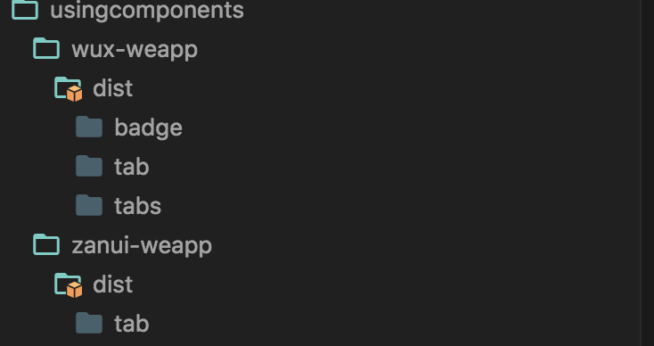
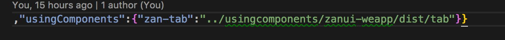

# wepy-plugin-usingcomponents
wepy-plugin-usingcomponents auto require wx min app usingcomponents

自动装载usingcomponents


解析单个文件中 config 部分 复制[usingComponents](https://developers.weixin.qq.com/miniprogram/dev/framework/custom-component/) 到项目目录下的,
请确保导入的是 [`usingComponents`](https://developers.weixin.qq.com/miniprogram/dev/framework/custom-component/)
## 安装

```
npm install wepy-plugin-usingcomponents --save-dev
```

## 配置`wepy.config.js`

```js
const path = require("path");
module.exports.plugins = {
    'usingcomponents': {
        dirs = [path.resolve(__dirname, 'node_modules')], //查找的路径, 取第一个找到的目录
        dist = "dist/usingcomponents" //输出到指定目录 , 此目录必须在小程序根目录下
    }
};
```
## 单个文件配置
```html
//page.wpy
//视图中可直接使用`usingComponents`中定义的组件
<template lang="pug">
  view
    
    zan-tab(scroll="{{ true }}"
      list="{{ [{id:1,title:'name'}] }}"
      selected-id="{{ tags[0].id }}"
      height="{{ 30 }}")
    
    
</template>
<script>
    import wepy from 'wepy'
    export default class Index extends wepy.page {
        //config中添加`usingComponents`
        config = {
            usingComponents: {
                //添加需要使用的组件名称和地址  , 查找路径在`wepy.config.js`中配置
                "zan-tab": "zanui-weapp/dist/tab" //此组件安装在node_modules下 , 最后会输出到dist/usingcomponents , 如下图所示
            }
        }
    }
</script>
```

## 效果


